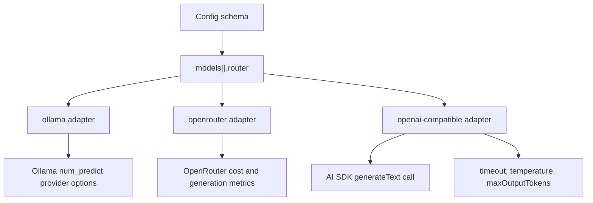

# feat: Add OpenAI-compatible local router

## Summary

Add a generic candidate-model router for local or self-hosted OpenAI-compatible servers, separate from both Ollama's native provider and OpenRouter's hosted provider. The new router should let users point `apocbench` at endpoints such as LM Studio, vLLM, llama.cpp server, or other `/v1/chat/completions`-compatible services without losing the existing OpenRouter cost and generation-metric behavior.

---

## Problem Frame

Issue #3 says local OpenAI-standard servers do not work and that only Ollama works. The current config schema confirms that candidate models can only use `ollama` or `openrouter`, and the CLI has hard-coded resolution branches for those two routers. OpenRouter is not a good generic local-server escape hatch because the runner layers OpenRouter-specific metadata, usage, cost, routing options, and generation-metrics behavior onto that router.

The right fix is to add a third router family with its own adapter and config contract rather than overloading OpenRouter or pretending OpenAI-compatible local servers are Ollama.

---

## Requirements

**Router capability**

- R1. Config must accept candidate models with `router: 'openai-compatible'` and a matching `routers.openaiCompatible` endpoint config for OpenAI-compatible local/self-hosted endpoints.
- R2. The new router must support a configurable `baseUrl`, optional `apiKeyEnv`, optional headers, request defaults, and local no-auth operation when `apiKeyEnv` is null or omitted.
- R3. The CLI must resolve candidate models through the new router and pass the model id to the AI SDK provider without requiring OpenRouter model naming conventions.
- R4. Candidate request defaults for timeout, temperature, and max output tokens must apply consistently to OpenAI-compatible models.

**Isolation from existing routers**

- R5. Existing `ollama` configs must continue to use `ollama-ai-provider-v2` and preserve Ollama-specific `num_predict` handling.
- R6. Existing `openrouter` configs must continue to use `@openrouter/ai-sdk-provider`, OpenRouter routing options, usage metadata, cost tracking, and generation metrics.
- R7. The new router must not make OpenRouter API keys required for local candidate models.

**Documentation and examples**

- R8. README and sample config must show how to configure a local OpenAI-compatible server, including the no-auth local case and the optional API-key case.

**Verification**

- R9. Schema, CLI/provider resolution, and runner provider-option behavior must have focused tests so the feature is validated without requiring a real local model server.

---

## High-Level Technical Design

The important design split is that OpenAI-compatible local servers share the AI SDK language-model interface with the existing routers, but they do not share OpenRouter's provider metadata contract. Cost, OpenRouter generation ids, and OpenRouter routing options remain tied to `router: 'openrouter'`.

---

## Key Technical Decisions

- KTD1. Add a distinct router id instead of reusing `openrouter`: use `router: 'openai-compatible'` in `models[]` and `routers.openaiCompatible` for the endpoint config. OpenRouter is a hosted service integration with its own provider metadata and routing semantics; local OpenAI-compatible servers need a generic endpoint integration.
- KTD2. Use `@ai-sdk/openai-compatible`: AI SDK 5 documents `createOpenAICompatible()` for providers that implement the OpenAI API and supports `baseURL`, optional API key, headers, query params, usage inclusion, and structured-output capability flags.
- KTD3. Keep judge support on OpenRouter for this plan: the issue is about local candidate servers, while the current judge schema is OpenRouter-only and carries structured scoring expectations. Local judge routing can be a follow-up if needed.
- KTD4. Apply `maxOutputTokens` to `openai-compatible` candidate calls through the standard AI SDK field: Ollama stays on its native `num_predict` provider option, while OpenRouter and OpenAI-compatible models receive standard output-token limiting.
- KTD5. Make no-auth local operation first-class: when `apiKeyEnv` is null or absent, the provider should be constructed without failing on a missing env var; when it names an env var, the CLI should fail clearly if that env var is missing.

---

## Implementation Units

### U1. Extend config schema for the new router

- **Goal:** Let configs describe a local OpenAI-compatible endpoint and route candidate models to it.
- **Requirements:** R1, R2, R7
- **Dependencies:** None
- **Files:**
  - `src/core/config/schema.ts`
  - `test/config-schema.test.ts`
- **Approach:** Add `routers.openaiCompatible` with `baseUrl`, nullable/optional `apiKeyEnv`, optional headers, optional query params if supported, and `default` request defaults. Extend `models[].router` to include the serialized value `openai-compatible`. Keep `judge.router` as `openrouter` in this plan. Use a small mapping helper if needed so the user-facing router id can stay readable while the TypeScript config key remains ergonomic.
- **Patterns to follow:** Existing `routers.ollama` and `routers.openrouter` schema blocks show strict object validation and shared `requestDefaultsSchema`.
- **Test scenarios:**
  - Given a config with `routers.openaiCompatible`, `apiKeyEnv: null`, and a model using `router: 'openai-compatible'`, schema parsing succeeds.
  - Given the same config with headers and query params, schema parsing preserves them.
  - Given a model with an unknown router id, schema parsing still rejects it.
  - Given an extra unknown key inside the new router config, schema parsing rejects it consistently with existing strict router objects.
- **Verification:** The schema type exposes the new router to downstream code without weakening strict validation for existing configs.

### U2. Add an OpenAI-compatible adapter

- **Goal:** Provide a small adapter that constructs an AI SDK provider instance for generic OpenAI-compatible endpoints.
- **Requirements:** R2, R3
- **Dependencies:** U1
- **Files:**
  - `src/adapters/openaiCompatible/client.ts`
  - `package.json`
  - `pnpm-lock.yaml`
  - `test/openai-compatible-client.test.ts` or a colocated adapter test path matching repo convention
- **Approach:** Add `@ai-sdk/openai-compatible` as a dependency and wrap `createOpenAICompatible()` in a local `createOpenAICompatibleClient()` function. The wrapper should normalize the base URL only as much as the provider requires, pass through headers/query params, set a stable provider name, and omit `apiKey` when the config has no env var. Avoid embedding endpoint-specific assumptions like `/api` versus `/v1`; users configure the exact base URL their server exposes.
- **Patterns to follow:** `src/adapters/ollama/client.ts` and `src/adapters/openrouter/client.ts` are thin wrappers over provider constructors.
- **Test scenarios:**
  - Given a base URL and no API key, the adapter creates a provider without throwing.
  - Given a base URL, API key, headers, and query params, the adapter passes them to the provider constructor.
  - Given a trailing slash in `baseUrl`, adapter behavior is stable and does not double path separators in generated request URLs.
- **Verification:** The adapter is a thin provider-construction layer with no benchmark-specific logic.

### U3. Resolve candidate models through the new router

- **Goal:** Wire the CLI's candidate model resolution so the new router produces a `LanguageModel` for each configured candidate.
- **Requirements:** R3, R7
- **Dependencies:** U1, U2
- **Files:**
  - `src/cli/index.tsx`
  - `test/integration-run.test.ts`
  - `test/orchestrator-regression.test.ts`
- **Approach:** Add a third branch to `resolveModel()`. If `apiKeyEnv` is a non-empty string, read it and fail with the same style as OpenRouter when missing; if it is null or absent, create the provider without an API key. Return the provider model for `m.model` without OpenRouter's `{ usage: { include: true } }` option unless the selected provider package requires an equivalent explicit option.
- **Patterns to follow:** The existing OpenRouter branch handles required env vars and headers; the existing Ollama branch handles local no-auth operation.
- **Test scenarios:**
  - Given a config with a local OpenAI-compatible router and `apiKeyEnv: null`, when resolving a candidate model, no OpenRouter env var is required.
  - Given a config with a local OpenAI-compatible router and `apiKeyEnv: 'LOCAL_OPENAI_API_KEY'`, when the env var is missing, the CLI fails with a clear missing-env message.
  - Given the env var is present, when resolving the model, the adapter receives the configured API key.
  - Given existing `openrouter` and `ollama` configs, their resolution behavior remains unchanged.
- **Verification:** Mocked tests prove provider construction branches without contacting real model servers.

### U4. Route candidate request options by provider family

- **Goal:** Ensure timeout, temperature, and max output tokens behave correctly for the new router while preserving existing router-specific behavior.
- **Requirements:** R4, R5, R6
- **Dependencies:** U1
- **Files:**
  - `src/core/runner/orchestrator.ts`
  - `test/orchestrator-regression.test.ts`
- **Approach:** Update the candidate call construction so `router: 'openai-compatible'` uses standard AI SDK `maxOutputTokens` precedence: `candidate.maxTokens`, then `models[].params.maxTokens`, then router default. Keep Ollama on provider-specific `num_predict` and keep OpenRouter provider options limited to OpenRouter routing metadata. Add a helper that maps a model router id to the matching router defaults, because `openai-compatible` maps to `routers.openaiCompatible` rather than a same-name object key.
- **Patterns to follow:** Current precedence for `candidate.maxTokens`, `models[].params.maxTokens`, and `routers.<router>.default.maxTokens` in `src/core/runner/orchestrator.ts`.
- **Test scenarios:**
  - Given an OpenAI-compatible candidate with router default max tokens, when a question is run, `generateText` receives that value as `maxOutputTokens`.
  - Given `candidate.maxTokens`, model-level max tokens, and router default all present, candidate-level max tokens wins for the new router.
  - Given an Ollama candidate, `maxOutputTokens` remains unset and `num_predict` remains under Ollama provider options.
  - Given an OpenRouter candidate with routing settings, OpenRouter provider options still include the OpenRouter provider block and generation metrics continue to key only from OpenRouter metadata.
- **Verification:** Regression tests inspect the mocked `generateText` call shape for all three router families.

### U5. Document local OpenAI-compatible configuration

- **Goal:** Make the new router discoverable and reduce configuration mistakes for local server users.
- **Requirements:** R8
- **Dependencies:** U1, U2, U3, U4
- **Files:**
  - `README.md`
  - `apocbench.yml`
  - `apocbench-lfm2.5-candidate-only.yml`
- **Approach:** Add a concise README provider section for OpenAI-compatible local servers. Show a no-auth local example and an API-key example. Update sample YAML with a commented router block and commented model entry so existing default runs are unchanged.
- **Patterns to follow:** The existing README's "Providers / routers" section is concise and user-facing; `apocbench.yml` already uses commented model examples for optional providers.
- **Test scenarios:**
  - Test expectation: none -- documentation and sample-comment changes are covered indirectly by schema tests and any existing YAML parse coverage if the examples are activated later.
- **Verification:** A user can copy the documented fields into config and understand when to set `apiKeyEnv` versus leaving it null.

---

## Scope Boundaries

- Do not replace the existing Ollama adapter; native Ollama support remains valid and should continue working.
- Do not use `openrouter` as the generic local server router; keep OpenRouter-specific usage, cost, routing, and generation-metric behavior isolated.
- Do not add local judge routing in this plan. The current judge path is OpenRouter-only and has structured scoring assumptions that need separate design if local judging is desired.
- Do not auto-detect whether a server wants `/api`, `/v1`, or another prefix. The configured `baseUrl` is the contract.

### Deferred to Follow-Up Work

- Add local OpenAI-compatible judge support after deciding how structured outputs and rubric completeness retries should behave on non-OpenRouter servers.
- Add an optional live smoke fixture for a known local server once the project has a standard local-server test harness.

---

## Risks & Dependencies

- Dependency risk: adding `@ai-sdk/openai-compatible` increases the AI SDK provider surface. Pin through the lockfile and keep the wrapper thin so future provider updates are easy to inspect.
- Compatibility risk: OpenAI-compatible servers differ in support for usage, streaming, structured outputs, and token limits. The first version should target plain candidate `generateText` calls and document that users must configure the base URL their server actually exposes.
- Type risk: the hyphenated model router id intentionally maps to the camelCase `routers.openaiCompatible` config key. Keep that mapping centralized so it does not leak as repeated bracket indexing throughout the runner.

---

## Sources & Research

- GitHub issue #3: `doesn't work on windows`, reporting that local OpenAI-standard servers do not work and only Ollama works.
- Local code: `src/core/config/schema.ts` restricts model routers to `ollama` and `openrouter`; `src/cli/index.tsx` resolves only those two provider families.
- AI SDK 5 docs: `@ai-sdk/openai-compatible` provides `createOpenAICompatible()` for providers implementing the OpenAI API, with configurable `baseURL`, `apiKey`, `headers`, `queryParams`, usage inclusion, and structured-output flags.
- AI SDK 5 OpenAI docs: `@ai-sdk/openai` also supports custom `baseURL`, but the dedicated OpenAI-compatible package is the more explicit fit for generic non-OpenAI local servers.
