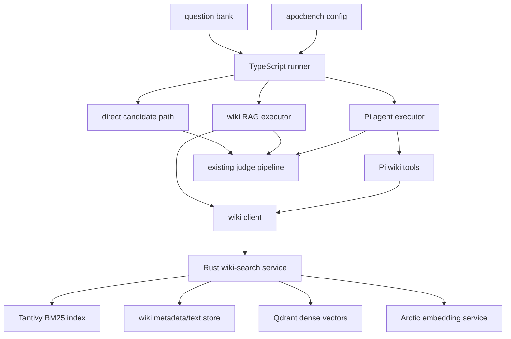
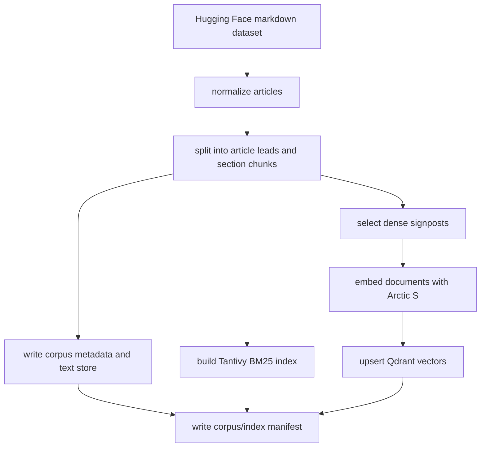
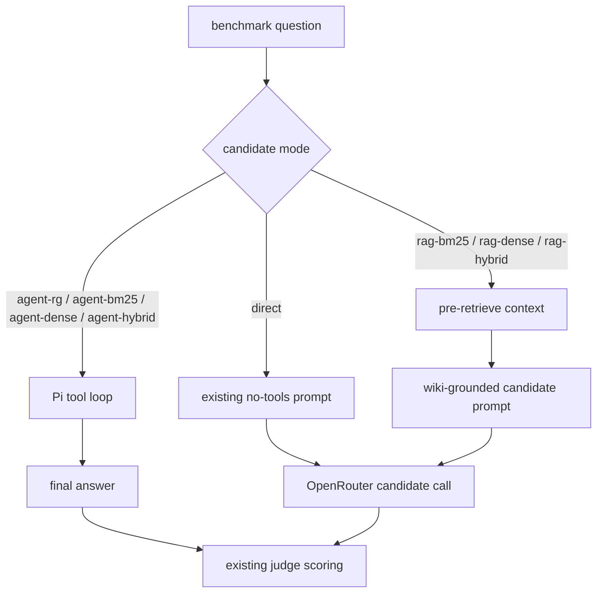

# feat: Add Wikipedia retrieval agent benchmark track

## Summary

Add a Wikipedia-backed benchmark track that keeps the current no-tools benchmark intact while adding comparable BM25, dense, hybrid, RAG, and Pi-agent retrieval conditions. The track uses Markdown Wikipedia as the corpus, a custom Rust/Tantivy search service for full-corpus BM25 and source reads, Snowflake Arctic Embed S for dense signposts, and OpenRouter-hosted candidate models for answer generation.

---

## Problem Frame

`apocalypse-bench` currently measures what a model can answer with no browsing, no tools, and no retrieval. That baseline is still valuable, but it does not answer the new question: how much does a local offline encyclopedia improve survival/offline-assistant performance, and which retrieval surface helps most?

The desired shape is not a generic RAG demo. The benchmark should compare retrieval conditions against the same question bank, preserve OpenRouter candidate routing, record retrieval behavior for inspection, and make the local knowledge base usable by a tool-using agent. The implementation also needs to fit a laptop setup: hosted LLMs through OpenRouter, local search/indexing, and dense embeddings constrained by the available 8GB GPU class.

---

## Requirements

**Corpus and Indexes**

- R1. The wiki track must use `marin-community/wikipedia-markdown` as the primary corpus source and preserve article id, URL, title, abstract, creation date, and Markdown text in normalized local artifacts.
- R2. The corpus pipeline must create deterministic article, section, and chunk identifiers so search hits, agent reads, reports, and reruns refer to stable source locations.
- R3. A custom Rust search tool must provide full-corpus BM25 over Markdown-derived chunks using Tantivy, plus exact source reads by article or chunk id.
- R4. Literal search must be available as an experimental control, but BM25 remains the main traditional-search surface.
- R5. Dense retrieval must use only `Snowflake/snowflake-arctic-embed-s`; the plan intentionally does not add fallback embedding-model plumbing.
- R6. Dense indexing must cover article signposts for the whole corpus and targeted section signposts for practical/survival-relevant areas, not every body chunk in Wikipedia.
- R7. Hybrid search must merge BM25 and dense results deterministically and return concise hit metadata plus stable read pointers.

**Benchmark Harness**

- R8. The existing direct no-tools candidate path must remain the default baseline and continue to work with current OpenRouter, Ollama, and OpenAI-compatible candidate routing.
- R9. Config must allow a candidate model entry to declare a wiki retrieval mode so the same hosted model can be run as separate comparable conditions, such as direct, BM25 RAG, dense RAG, hybrid RAG, and Pi-agent hybrid.
- R10. RAG modes must retrieve bounded wiki context before candidate generation and inject it into a distinct candidate prompt without changing judge scoring semantics.
- R11. Agent modes must run a Pi-based tool loop with bounded wiki tools and produce a final answer that can be judged by the existing judge pipeline.
- R12. Wiki tools must expose bounded `search`, `semantic_search`, `hybrid_search`, literal-search control, and `read` behavior without returning full articles from search calls.

**Traceability and Reporting**

- R13. Each wiki-enabled answer must persist retrieval trace metadata: mode, queries, hits, articles/chunks read, source titles, retrieval latency, and bounded source snippets or pointers.
- R14. Summary and HTML reports must make retrieval conditions comparable without hiding the original score, auto-fail rate, latency, and failure metrics.
- R15. Retrieval traces must be inspectable per question so failures can be attributed to model behavior, retrieval quality, tool-use behavior, or source mismatch.

**Operations and Documentation**

- R16. The indexing pipeline must have a small fixture path for tests and a full-corpus path for local runs, with disk-heavy outputs kept out of git.
- R17. Documentation must explain corpus download, index build, embedding build, Qdrant/vector service setup, wiki-enabled config, and how to compare conditions.
- R18. The implementation must avoid raw Wikimedia XML ingestion, Kiwix/ZIM ingestion, learned sparse embeddings, and alternate embedding model selection in this plan.

---

## High-Level Technical Design

### Component Topology



The TypeScript runner owns benchmark orchestration and scoring. The Rust `wiki-search` service owns corpus search, fusion, and source hydration. The embedding service owns Snowflake Arctic query/document vectors. Qdrant stores dense vectors and minimal payload pointers, while the Rust service keeps source text and BM25 metadata authoritative.

### Indexing Data Flow



The build has two scales: a tiny fixture corpus for tests and the full Markdown Wikipedia corpus for local benchmarking. The same normalized schema feeds both paths so unit tests validate the real data shape.

### Candidate Execution Modes



Mode names are part of the benchmark surface. The same underlying OpenRouter model can appear multiple times with different `model.id` values and `candidateMode` values so reports compare conditions directly.

---

## Output Structure

```text
crates/
  wiki-search/
    Cargo.toml
    src/
      main.rs
      corpus/
      bm25/
      dense/
      service/
      read/
    tests/
      fixtures/
scripts/
  wiki_download.py
  wiki_embed.py
src/
  core/
    wiki/
    runner/
  adapters/
    pi/
test/
  wiki-*.test.ts
docs/
  wiki-retrieval.md
```

The exact module split may change during implementation, but the plan expects a Rust search crate, Python corpus/embedding entrypoints, TypeScript runner integration, and user-facing documentation.

---

## Key Technical Decisions

- KTD1. Markdown Wikipedia over raw dumps or ZIM: `marin-community/wikipedia-markdown` already exposes English Wikipedia rows with article metadata and Markdown text, which removes the highest-risk extraction work and lets the plan focus on retrieval and benchmarking.
- KTD2. Rust/Tantivy for BM25: Tantivy is a Rust search-engine library with schema-based indexing, stored fields, query parsing, and `TopDocs` retrieval, which is the right level of control for a benchmark-specific local search tool.
- KTD3. Rust service boundary instead of Node FFI: TypeScript should call `wiki-search` through a stable local HTTP or JSONL protocol. That keeps the benchmark runner portable and avoids native Node binding churn.
- KTD4. Qdrant for dense vectors: full-corpus article signposts still mean millions of vectors. Qdrant provides on-disk vector storage, quantization options, and hybrid/vector primitives that are safer than a custom ANN implementation for this plan.
- KTD5. Arctic S only: `Snowflake/snowflake-arctic-embed-s` keeps the 384-dimension budget while materially outperforming MiniLM-class baselines in reported retrieval metrics. Model selection is not exposed as a benchmark feature in this plan.
- KTD6. Dense signposts, not full dense body chunks: BM25 covers the full Markdown body. Dense vectors are reserved for semantic discovery through article leads and targeted practical sections so the index fits the laptop constraint.
- KTD7. Model-level candidate modes: adding `candidateMode` to each model entry lets the same OpenRouter model be configured as multiple benchmark conditions without adding a separate orchestration axis.
- KTD8. Include RAG controls alongside agent modes: non-agent RAG modes separate retrieval quality from agent tool-use skill, while Pi-agent modes test whether models can search and read the local wiki effectively.
- KTD9. Retrieval trace is first-class run data: source usage must be stored beside the candidate result, not inferred from prompts later, so reports and regressions can explain why a wiki-enabled answer helped or hurt.
- KTD10. No learned sparse embeddings in this plan: BM25 is the sparse/traditional retrieval baseline. Learned sparse retrieval would add another model pipeline without being necessary for the first complete track.

---

## Implementation Units

### U1. Add Rust wiki-search workspace and service skeleton

- **Goal:** Establish a Rust binary crate that can ingest a fixture corpus, open indexes, and serve bounded search/read requests for the TypeScript runner.
- **Requirements:** R3, R4, R7, R16
- **Dependencies:** None
- **Files:**
  - `Cargo.toml`
  - `crates/wiki-search/Cargo.toml`
  - `crates/wiki-search/src/main.rs`
  - `crates/wiki-search/src/service/`
  - `crates/wiki-search/tests/service_smoke.rs`
  - `package.json`
- **Approach:** Create a small CLI/service with subcommands for ingest, search, read, and serve. The service contract should be local-only, deterministic, and JSON-based so TypeScript tests can drive it without native bindings. Keep command names stable enough for docs, but defer exact flags to implementation.
- **Patterns to follow:** Existing repo scripts are thin wrappers around focused entrypoints; preserve that style instead of hiding setup behind a large shell script.
- **Test scenarios:**
  - Given a tiny fixture corpus, when the service starts, it reports a healthy manifest with corpus and index versions.
  - Given malformed JSON input to the service protocol, it returns a structured error and stays alive.
  - Given a missing index directory, search/read calls fail clearly without panicking.
  - Given the fixture corpus is ingested twice, generated article and chunk ids remain stable.
- **Verification:** The Rust crate builds independently and exposes a service protocol that TypeScript can call in tests.

### U2. Build the Markdown Wikipedia normalization and chunking pipeline

- **Goal:** Convert the Hugging Face Markdown dataset into deterministic local article, section, and chunk artifacts suitable for BM25, dense signposts, and source reads.
- **Requirements:** R1, R2, R6, R16
- **Dependencies:** U1
- **Files:**
  - `scripts/wiki_download.py`
  - `crates/wiki-search/src/corpus/`
  - `crates/wiki-search/tests/corpus_ingest.rs`
  - `crates/wiki-search/tests/fixtures/wiki-mini.jsonl`
  - `.gitignore`
- **Approach:** Use a Python download/materialization entrypoint for Hugging Face dataset access, then normalize into a Rust-owned corpus format. Split by Markdown headings first, preserve article lead chunks, maintain heading paths, and write a manifest containing dataset identity, row count, chunk count, and build settings. Keep full corpus outputs under ignored data/index directories.
- **Patterns to follow:** Existing dataset guidance treats JSONL as source-of-truth and validates schema through focused tests; the wiki corpus should similarly have a normalized fixture contract.
- **Test scenarios:**
  - Given fixture rows with title, abstract, URL, date, and Markdown text, normalization preserves all metadata.
  - Given headings and long sections, chunking produces stable heading paths and bounded chunk sizes.
  - Given a redirect-like or very short article, normalization either keeps it with a clear type marker or excludes it according to a documented rule.
  - Given repeated ingestion of the same fixture, chunk ids and manifest hashes are unchanged.
- **Verification:** Fixture ingestion produces stable article/chunk records and a manifest that later units can consume.

### U3. Implement full-corpus BM25, literal search control, and source reads

- **Goal:** Provide the performant traditional retrieval layer and exact source hydration behavior.
- **Requirements:** R3, R4, R7, R12
- **Dependencies:** U1, U2
- **Files:**
  - `crates/wiki-search/src/bm25/`
  - `crates/wiki-search/src/read/`
  - `crates/wiki-search/src/service/`
  - `crates/wiki-search/tests/bm25_search.rs`
  - `crates/wiki-search/tests/read_source.rs`
- **Approach:** Build a Tantivy schema with boosted title and heading fields, body text for BM25, stable ids as stored fields, and compact snippets for search output. Search returns hit metadata and read pointers only. Read calls hydrate bounded chunk text or surrounding context from the local corpus store. Literal search is an explicit control path and should share the same output shape as BM25 where possible.
- **Patterns to follow:** Reports currently show prompts/completions separately from aggregate scores; keep search hits similarly concise and defer large source text to read calls.
- **Test scenarios:**
  - Given a fixture query matching an exact title term, BM25 ranks the title/lead hit above body-only matches.
  - Given a query matching a heading phrase, the returned hit includes the correct heading path and stable chunk id.
  - Given a literal pattern, literal search returns only exact text matches and uses the same source pointer shape as BM25.
  - Given a read request for a chunk id, the service returns bounded Markdown text and source metadata.
  - Given a read request for an unknown id, the service returns a structured not-found error.
- **Verification:** BM25, literal search, and read behavior are deterministic on the fixture corpus.

### U4. Add Arctic S embedding and Qdrant dense index pipeline

- **Goal:** Build dense semantic discovery within the laptop memory budget using only Snowflake Arctic Embed S.
- **Requirements:** R5, R6, R7, R16, R18
- **Dependencies:** U2
- **Files:**
  - `scripts/wiki_embed.py`
  - `crates/wiki-search/src/dense/`
  - `crates/wiki-search/tests/dense_manifest.rs`
  - `docs/wiki-retrieval.md`
- **Approach:** Use a Python embedding entrypoint based on Sentence Transformers for document and query embeddings. Document embeddings cover all article signposts plus targeted section signposts selected by deterministic practical-domain rules and benchmark-question preselection. Store vectors in Qdrant with minimal payload pointers and a manifest recording model id, dimension, normalization, prompt behavior, signpost selection rules, and collection identity.
- **Patterns to follow:** OpenRouter generation metrics are best-effort and do not block runs; dense-index health checks should similarly surface state clearly without hiding benchmark failures.
- **Test scenarios:**
  - Given fixture articles, document embedding input for an article signpost includes title, abstract, and lead text in the expected order.
  - Given fixture sections with practical-domain headings, targeted section signpost selection includes the expected section records.
  - Given non-practical fixture sections, targeted selection excludes them unless they appear in benchmark-question preselection.
  - Given a manifest with a non-Arctic model id or non-384 dimension, the dense search path refuses to run.
  - Given Qdrant is unavailable, dense/hybrid health checks fail clearly while BM25-only search remains usable.
- **Verification:** Dense fixture indexing produces a Qdrant collection and manifest that the Rust service can validate before serving dense queries.

### U5. Implement hybrid search and wiki tool contracts

- **Goal:** Expose the retrieval surfaces that RAG and agent modes will use.
- **Requirements:** R7, R12, R15
- **Dependencies:** U3, U4
- **Files:**
  - `crates/wiki-search/src/service/`
  - `crates/wiki-search/src/dense/`
  - `crates/wiki-search/tests/hybrid_search.rs`
  - `src/core/wiki/types.ts`
  - `test/wiki-tool-contract.test.ts`
- **Approach:** Add BM25, dense, hybrid, literal, and read service methods with one shared result schema. Hybrid search should use deterministic fusion and article-diversity limits so a single article cannot crowd out all results. Tool outputs should include source pointers, title, heading path, mode, scores, and concise snippets.
- **Patterns to follow:** Existing runner events are sanitized before reaching UI/logs; wiki tool outputs should similarly bound text and avoid dumping full source bodies into search responses.
- **Test scenarios:**
  - Given BM25 and dense hits with overlapping chunk ids, hybrid fusion deduplicates and records both contributing sources.
  - Given many hits from one article, hybrid search applies article diversity before returning final hits.
  - Given a dense query when Qdrant is unhealthy, hybrid search returns a clear dense-unavailable error rather than silently degrading to BM25.
  - Given a read request with a maximum character budget, returned text is bounded and marks truncation.
- **Verification:** TypeScript contract tests and Rust fixture tests agree on the same JSON shape.

### U6. Add wiki configuration, client, and readiness checks to the TypeScript runner

- **Goal:** Let benchmark configs point at the local wiki services and validate wiki readiness before a wiki-enabled run starts.
- **Requirements:** R8, R9, R12, R16
- **Dependencies:** U5
- **Files:**
  - `src/core/config/schema.ts`
  - `src/core/config/schema.test.ts`
  - `src/core/config/loadConfig.ts`
  - `src/core/wiki/client.ts`
  - `src/core/wiki/types.ts`
  - `test/wiki-config.test.ts`
  - `test/wiki-client.test.ts`
  - `apocbench.yml`
- **Approach:** Add a `wiki` config block for service endpoint, corpus/index manifests, per-call limits, and enablement. Add `candidateMode` to model entries with `direct` as the default. Validate that wiki modes require wiki config and that direct mode remains compatible with existing configs.
- **Patterns to follow:** Current schema uses strict Zod objects and focused tests for invalid combinations; keep wiki config equally strict.
- **Test scenarios:**
  - Given an existing config without `wiki` and no `candidateMode`, schema parsing succeeds and defaults to direct mode.
  - Given `candidateMode: 'rag-hybrid'` without wiki config, schema parsing fails with a clear path.
  - Given wiki config with service endpoint and limits, schema parsing preserves those values.
  - Given the wiki service health response has the wrong corpus manifest id, readiness fails before candidate generation.
  - Given the wiki service is healthy, readiness returns searchable mode capabilities used by later units.
- **Verification:** Existing non-wiki configs remain valid and wiki-enabled configs fail early when local services are missing or mismatched.

### U7. Add wiki RAG candidate executors

- **Goal:** Add non-agent retrieval modes that pre-retrieve wiki context before candidate generation.
- **Requirements:** R8, R9, R10, R13, R15
- **Dependencies:** U6
- **Files:**
  - `src/core/runner/orchestrator.ts`
  - `src/core/runner/candidateExecutor.ts`
  - `src/core/prompts/candidatePrompt.ts`
  - `src/core/wiki/rag.ts`
  - `test/wiki-rag-runner.test.ts`
  - `test/prompts.test.ts`
- **Approach:** Split candidate generation behind a small executor abstraction so direct mode keeps the current path, while RAG modes retrieve context through the wiki client, build a wiki-grounded prompt, and then call the same hosted candidate model. Keep judge prompt and scoring unchanged. RAG traces should include retrieval mode, retrieval queries, returned hits, selected context, and source pointers.
- **Patterns to follow:** Existing candidate generation captures metrics and then queues judge work; preserve that lifecycle and add retrieval metadata beside candidate metrics.
- **Test scenarios:**
  - Given direct mode, the generated prompt and provider call match the current no-tools behavior.
  - Given BM25 RAG mode, the runner issues a BM25 search, reads selected chunks, and includes bounded source context in the candidate prompt.
  - Given dense RAG mode, the runner issues semantic search, reads selected chunks, and records dense retrieval metadata without requiring BM25 hits.
  - Given hybrid RAG mode, the runner issues hybrid search and records mode-specific retrieval trace data.
  - Given the wiki client fails before candidate generation, the result is a candidate failure with a redacted, clear error.
  - Given retrieved context exceeds configured budget, prompt construction truncates by source boundaries and records truncation in the trace.
- **Verification:** Mocked runner tests prove direct mode remains unchanged and RAG modes produce persisted retrieval traces.

### U8. Add Pi agent candidate executors and bounded wiki tools

- **Goal:** Run tool-using wiki agents as benchmark candidates while still feeding one final answer into the existing judge.
- **Requirements:** R9, R11, R12, R13, R15
- **Dependencies:** U6, U7
- **Files:**
  - `src/adapters/pi/`
  - `src/core/wiki/agentTools.ts`
  - `src/core/runner/agentExecutor.ts`
  - `test/wiki-agent-tools.test.ts`
  - `test/wiki-agent-runner.test.ts`
  - `package.json`
  - `pnpm-lock.yaml`
- **Approach:** Use `@earendil-works/pi-agent-core` to create a bounded agent loop with wiki tools only. The agent system prompt should tell the model when to search/read, how to treat Wikipedia as a fallible source, and how to finish with a final answer for judging. Enforce max turns, max tool calls, per-tool text budgets, timeout, and trace recording at the harness boundary.
- **Patterns to follow:** Current runner isolates provider resolution from orchestration. Keep Pi integration behind an adapter so direct and RAG executors do not depend on Pi types.
- **Test scenarios:**
  - Given an agent BM25 mode, the tool list contains BM25 search and read but not dense/hybrid tools.
  - Given an agent dense mode, the tool list contains semantic search and read but not BM25/hybrid tools.
  - Given an agent hybrid mode, the tool list contains hybrid search and read with the configured limits.
  - Given an agent exceeds max turns or tool calls, the candidate fails with a structured harness error.
  - Given a tool call returns an oversized result, the tool output is bounded and the trace records truncation.
  - Given the agent produces a final answer, the runner persists it as the candidate completion and sends it to the existing judge pipeline.
- **Verification:** Mocked Pi tests prove tool availability, limits, final answer extraction, and trace persistence without contacting OpenRouter.

### U9. Persist retrieval traces and update reports

- **Goal:** Make wiki-enabled runs explainable and comparable in existing CLI/report outputs.
- **Requirements:** R13, R14, R15
- **Dependencies:** U7, U8
- **Files:**
  - `src/storage/sqlite/schema.sql`
  - `src/storage/sqlite/migrate.test.ts`
  - `src/storage/sqlite/results.ts`
  - `src/core/runner/types.ts`
  - `src/core/scoring/aggregate.ts`
  - `src/reports/html/renderHtml.ts`
  - `src/reports/markdown/index.ts`
  - `dashboard/lib/series.test.ts`
  - `test/retrieval-trace-report.test.ts`
- **Approach:** Add a retrieval trace column or companion table keyed by run/model/question. Keep aggregate scoring unchanged, but include retrieval mode, search/read counts, retrieval latency, source count, and selected source titles in reports. Detailed traces should be available per question without making the model summary table noisy.
- **Patterns to follow:** `candidate_metrics_json` already carries per-answer metrics; retrieval trace can mirror that approach if a separate table is unnecessary for query patterns.
- **Test scenarios:**
  - Given a direct-mode result, reports render without retrieval sections.
  - Given a RAG result with trace metadata, HTML reports show retrieval mode, source count, and source titles in the per-question detail.
  - Given an agent result with multiple tool calls, the persisted trace preserves call order and bounded output metadata.
  - Given an older database without retrieval columns, migration creates the new storage without losing existing rows.
  - Given aggregate summaries, scores and auto-fail metrics remain unchanged by retrieval metadata.
- **Verification:** Existing report tests still pass and new fixtures show wiki trace details for RAG and agent modes.

### U10. Add docs, config examples, and comparison workflow

- **Goal:** Make the one-shot feature usable on the laptop without requiring the implementer to reverse-engineer setup.
- **Requirements:** R14, R16, R17, R18
- **Dependencies:** U1, U2, U3, U4, U5, U6, U7, U8, U9
- **Files:**
  - `README.md`
  - `docs/wiki-retrieval.md`
  - `apocbench.yml`
  - `apocbench-wiki.yml`
  - `package.json`
  - `.gitignore`
- **Approach:** Document corpus acquisition, fixture indexing, full indexing, embedding/Qdrant setup, service readiness, and run-mode comparison. Add a wiki example config that repeats at least one OpenRouter model across direct, RAG, and agent modes so reports naturally show condition differences.
- **Patterns to follow:** Existing README provider sections and plan docs favor concise, copyable examples without turning documentation into a tutorial novel.
- **Test scenarios:**
  - Given the wiki example config, schema validation accepts all declared run modes.
  - Given ignored data/index paths, git status does not show generated corpus, Tantivy, or Qdrant artifacts.
  - Test expectation: no live full-corpus index build in unit tests; full-corpus validation is an operational smoke documented for manual/local execution.
- **Verification:** A user can follow the docs to build fixture indexes, start services, validate config, and run a small wiki-enabled benchmark subset.

---

## Scope Boundaries

- Keep the current no-tools benchmark semantics intact; wiki retrieval is an additional track, not a replacement.
- Use Markdown Wikipedia only. Do not implement raw Wikimedia XML extraction or Kiwix/ZIM ingestion in this plan.
- Use `Snowflake/snowflake-arctic-embed-s` only. Do not add fallback model selection, embedding model bake-offs, or multi-model index support.
- Use BM25 as the sparse/traditional retrieval layer. Do not add learned sparse embeddings such as SPLADE or BGE-M3 sparse output.
- Do not dense-embed every Wikipedia body chunk. Full body coverage is through BM25 and exact reads; dense is for article and targeted section discovery.
- Do not change judge scoring semantics for this feature. Retrieval/source behavior is diagnostic metadata unless a later plan changes scoring.
- Do not make Qdrant a general app dependency for non-wiki runs. Direct runs should not require wiki services.

### Deferred to Follow-Up Work

- Add learned sparse retrieval only after BM25+dense+hybrid results show a specific failure mode it can address.
- Add reranking only after retrieval traces show top-k ordering is the main bottleneck.
- Add freshness/update automation for newer Wikipedia snapshots after the first full local corpus is stable.
- Add source-support scoring if manual review shows the existing judge over-rewards citation-shaped but unsupported answers.

---

## System-Wide Impact

- **Runtime architecture:** The project becomes a TypeScript benchmark runner with a Rust local search service and a Python embedding pipeline. This is intentional, but it adds setup complexity that docs and readiness checks must absorb.
- **Storage:** Full corpus artifacts, Tantivy indexes, Qdrant collections, and dense manifests are large local artifacts and must remain outside git.
- **Run database:** Retrieval traces expand per-question result storage and report rendering, but direct runs must remain compatible with old rows and configs.
- **Benchmark interpretation:** Scores from wiki-enabled modes answer a different question than no-tools scores. Reports must label conditions clearly so the original benchmark is not diluted.
- **Cost and latency:** Agent modes can multiply OpenRouter calls or tool turns. The harness must enforce turn/tool limits and surface retrieval/tool latency separately from model latency where useful.

---

## Risks & Dependencies

- **Corpus dependency:** The Markdown dataset is easier to use than raw dumps, but it is derived from a specific upstream conversion and may not be current. The manifest must record dataset identity so results are reproducible.
- **License dependency:** The dataset is CC-BY-SA-4.0. Local benchmark use is fine, but redistributed artifacts or excerpts need license-aware handling.
- **Disk and memory risk:** Millions of dense signposts can still be large. Qdrant quantization and on-disk storage are part of the plan, and the section-level dense set is intentionally targeted.
- **Embedding pipeline risk:** Arctic S usage requires distinct document and query embedding behavior. The query prompt/prefix must be centralized so search tools do not silently use document-style embeddings for queries.
- **Operational risk:** Qdrant and the embedding service are local prerequisites for dense/hybrid modes. BM25-only modes should remain available when dense services are not healthy.
- **Agent variance risk:** Tool-using agents may fail because of tool strategy rather than retrieval quality. RAG controls and trace logging are included to separate those failure modes.
- **Migration risk:** Adding retrieval trace storage must not break older run databases or existing reports.

---

## Sources & Research

- Local repo: `README.md` defines the current benchmark as no browsing, no tools, and no retrieval; this plan preserves that as direct mode.
- Local repo: `src/core/runner/orchestrator.ts` owns candidate generation, judge queuing, cost/usage metrics, and run summaries; new executors should preserve this lifecycle.
- Local repo: `src/core/config/schema.ts` already supports `ollama`, `openrouter`, and `openai-compatible` candidate routers; retrieval mode can be a separate model-entry concern.
- Local repo: `src/storage/sqlite/schema.sql` and `src/storage/sqlite/results.ts` store per-question results; retrieval traces should extend this persistence layer.
- Hugging Face dataset: [`marin-community/wikipedia-markdown`](https://huggingface.co/datasets/marin-community/wikipedia-markdown) lists English Markdown Wikipedia rows with `id`, `url`, `title`, `abstract`, `date_created`, and `text`, about 8.29M rows, and CC-BY-SA-4.0 licensing.
- Tantivy docs: [`tantivy`](https://docs.rs/tantivy/latest/tantivy/) is a Rust search-engine library; its schema docs cover indexed/stored fields and search result hydration.
- Snowflake model card: [`Snowflake/snowflake-arctic-embed-s`](https://huggingface.co/Snowflake/snowflake-arctic-embed-s) is a 384-dimensional, 33M-parameter retrieval embedding model with documented query-prompt usage.
- Qdrant docs: [quantization](https://qdrant.tech/documentation/manage-data/quantization/) and [text/hybrid search docs](https://qdrant.tech/documentation/search/text-search/) support the dense-vector storage and hybrid-search decision.
- Pi docs: [`@earendil-works/pi-agent-core`](https://raw.githubusercontent.com/earendil-works/pi/main/packages/agent/README.md) provides stateful agents with tools, events, bounded tool execution hooks, and low-level loop APIs suitable for a benchmark harness.
